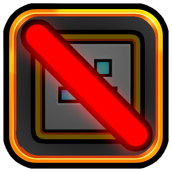

# BotCommentRemoval
Geode mod that filters out suspicious comments.

Simplest form of detection - by keywords like 'discord./gg'.



# Geode-generated

## Getting started
We recommend heading over to [the getting started section on Geode SDK docs](https://docs.geode-sdk.org/getting-started/) for useful info on what to do next.

## Build instructions
For more info, see [Geode SDK docs](https://docs.geode-sdk.org/getting-started/create-mod#build)
```sh
# Assuming you have the Geode CLI set up already
geode build
```

# Resources
* [Geode SDK Documentation](https://docs.geode-sdk.org/)
* [Geode SDK Source Code](https://github.com/geode-sdk/geode/)
* [Geode CLI](https://github.com/geode-sdk/cli)
* [Bindings](https://github.com/geode-sdk/bindings/)
* [Dev Tools](https://github.com/geode-sdk/DevTools)
